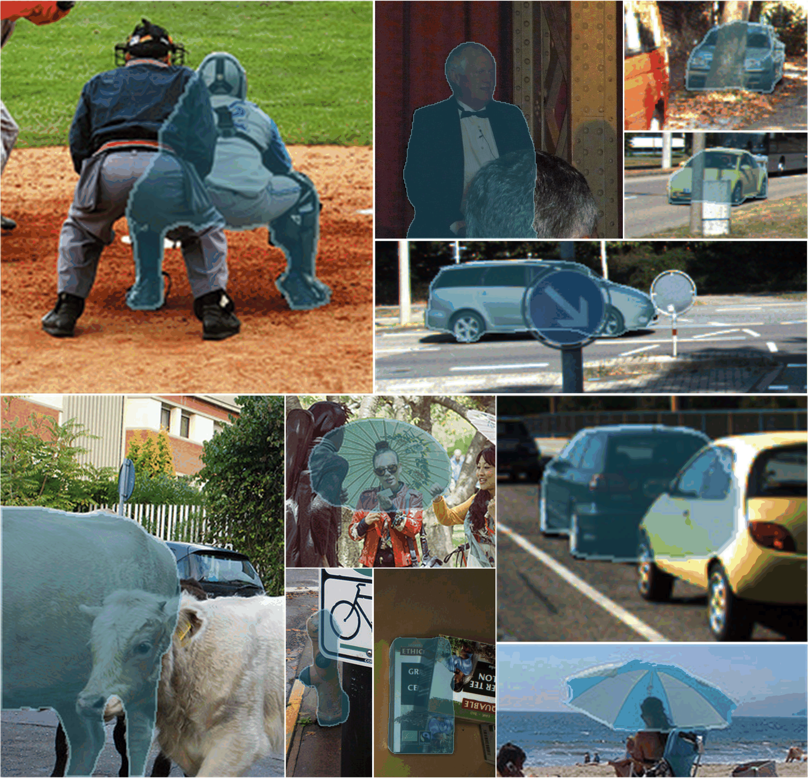

## HIDA: A Human-Intuition-Guided Depth-Aware Framework for Zero-Shot Amodal Segmentation (ECCV 2026)

#### Prepare the dataset using the scripts in the tools.

Zero-sample effect demonstration

  

